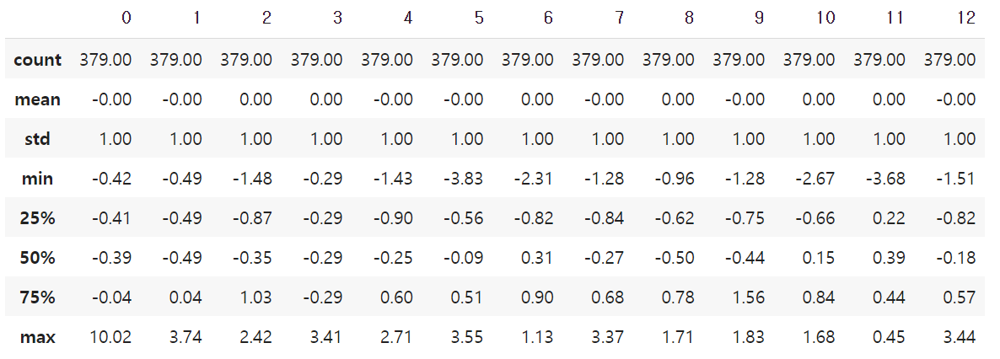
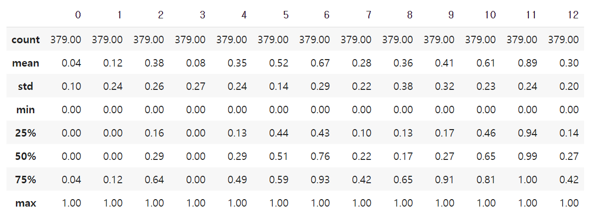

# 회귀(Regression) - Scaler, 파이프라인, 다항식 모델

* toc
{:toc .large-only}

## Scaler

**라이브러리 로드**

```py
from sklearn.preprocessing import StandardScaler, MinMaxScaler, RobustScaler
```

**통계값 확인**

```py
x_train.describe()
```

**StandardScaler**

```py
std_scaler = StandardScaler()
std_scaled = std_scaler.fit_transform(x_train)
round(pd.DataFrame(std_scaled).describe(), 2)
```

StandardScaler를 통해 평균값(mean) 0, 표준편차(std) 1로 맞추어준다.



**MinMaxScaler**

```py
minmax_scaler = MinMaxScaler()
minmax_scaled = minmax_scaler.fit_transform(x_train)
round(pd.DataFrame(minmax_scaled).describe(), 2)
```

MinMaxScaler를 통해 min 값과 max 값을 0 ~ 1 사이 값으로 정규화 시켜준다.



**RobustScaler**

```py
robust_scaler = RobustScaler()
robust_scaled = robust_scaler.fit_transform(x_train)
round(pd.DataFrame(robust_scaled).median(), 2)
```

중앙값(median)은 0, IQR(Inter Quartile Range)이 1이 되도록 변환해준다.

## 파이프라인

**파이프라인 함수 로드**

```py
from sklearn.pipeline import make_pipeline
```

**파이프라인 생성**

```py
elasticnet_pipeline = make_pipeline(
    StandardScaler(),
    ElasticNet(alpha=0.1, l1_ratio=0.2)
)
```

- Scaler 먼저 적용
- 모델 정의

**학습 및 예측**

```py
elasticnet_pred = elasticnet_pipeline.fit(x_train, y_train).predict(x_test)
```

```py
elasticnet_no_pipeline = ElasticNet(alpha=0.1, l1_ratio=0.2)
no_pipeline_pred = elasticnet_no_pipeline.fit(x_train, y_train).predict(x_test)
mse_eval('No Standard ElasticNet', elasticnet_pred, y_test)
```

## Polynomial Features

> Polynomial Features란 다항식 계수간의 상호작용을 통해 새로운 feature를 생성하는 것을 말한다. 예를들어 [a, b] feature에 degree=2라면 polynomial features는 [1, a, b, $a^2$, ab, $b^2$]이다.


**PolynomialFeatures 함수 로드**

```py
from sklearn.preprocessing import PolynomialFeatures
```

**Polynomial Features 생성**

```py
poly = PolynomialFeatures(degree=2, include_bias=False)
poly_features = poly.fit_transform(x_train)[0]
```

**파이프라인 생성**

```py
poly_pipeline = make_pipeline(
    PolynomialFeatures(degree=2, include_bias=False),
    StandardScaler(),
    ElasticNet(alpha=0.1, l1_ratio=0.2)
)
```

**학습 및 예측**

```py
poly_pred = poly_pipeline.fit(x_train, y_train).predict(x_test)
mse_eval('Poly ElasticNet', poly_pred, y_test)
```


그림 처럼 큰 개선을 보여주는 것을 알 수 있다.


<span style="font-size:70%">[참조] 패스트캠퍼스 - 직장인을 위한 파이썬 데이터분석 올인원 패키지 Online.</span>

끝!
