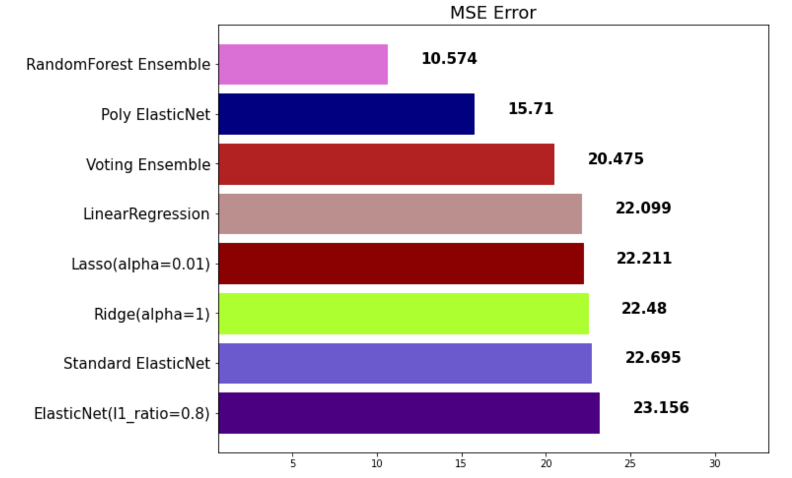
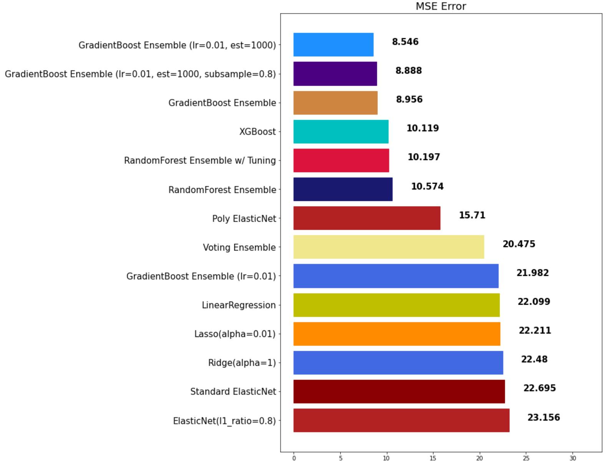
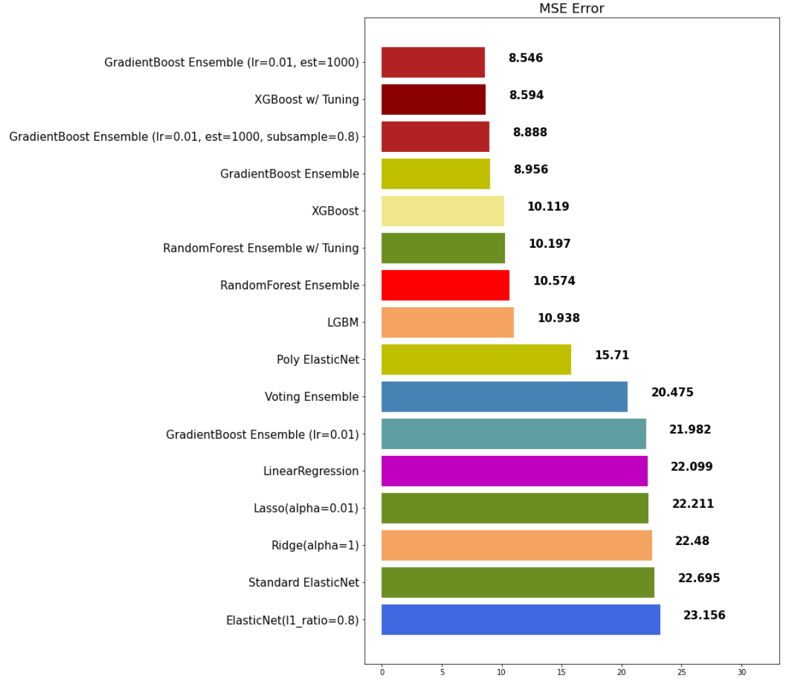

# 앙상블

* toc
{:toc .large-only}

## 앙상블(Ensemble)이란?

> 머신러닝 앙상블이란 여러 개의 머신러닝 모델을 이용해 최적의 답을 찾아내는 기법을 말한다.

**앙상블 기법 종류**

- 보팅(Voting): 투표를 통해 결과 도출
- 배깅(Bagging): 샘플 중복 생성을 통해 결과 도출
- 부스팅(Boosting): 이전 오차를 보완하면서 가중치 부여
- 스태킹(Stacking): 여러 모델을 기반으로 예측된 결과를 통해 meta모델이 다시 한 번 예측

## Voting

Voting 방식과 Bagging 방식은 투표 방식으로 유사하지만 큰 차이점이 있다.
- **Voting:** 다른 알고리즘 모델을 조합해 사용
- **Bagging:** 같은 알고리즘 내 다른 샘플 조합 사용

**Voting 알고리즘 모듈 로드**

```py
from sklearn.ensemble import VotingRegressor, VotingClassifier
```

**Tuple 형태로 모델 정의**

```py
single_models = [
    ('linear_reg', linear_reg), 
    ('ridge', ridge), 
    ('lasso', lasso), 
    ('elasticnet_pipeline', elasticnet_pipeline), 
    ('poly_pipeline', poly_pipeline)
]
```

**모델 생성 및 학습**

```py
voting_regressor = VotingRegressor(single_models, n_jobs=-1)
voting_regressor.fit(x_train, y_train)
```

**모델 예측 및 평가**

```py
voting_pred = voting_regressor.predict(x_test)
mse_eval('Voting Ensemble', voting_pred, y_test)
```


**Classification**

Voting 앙상블로 분류기 모델을 만들 때 중요 파라미터가 존재한다. 예를 다음과 같은 예시로 확인해 보도록한다.

- 분류로 예측한 값: 1, 0, 0, 1, 1
- class 0 확률: 0.4, 0.1, 0.9, 0.4, 0.4
- class 1 확률: 0.6, 0.1, 0.1, 0.6, 0.6

이 때 hard와 soft 파라미터는 각각 어떻게 예측하는지 확인한다.

- **hard:** 확률과 관계없이 1이 3표, 0이 2표이기 때문에 더 많은 표를 받은 **1**로 최종 예측을 한다.
- **soft:** 확률을 계산해서 예측을 한다.
  - class 0 최종 확률: (0.4 + 0.9 + 0.9 + 0.4 + 0.4) / 5 = 0.44
  - class 1 최종 확률: (0.6 + 0.1 + 0.1 + 0.6 + 0.6) / 5 = 0.4
  - 더 확률이 높은 0으로 최종 예측을 한다.

**사용 예시**

```py
models = [
    ('Logi', LogisticRegression()), 
    ('ridge', RidgeClassifier())
]
vc = VotingClassifier(models, voting='hard')
```

## Bagging

Bagging은 Bootstrap Aggregating의 줄임말로 여러 데이터셋을 중첩 허용하게 하여 샘플링하고 분할하는 방식이다. 예를 들어 다음 데이터 셋이 있다고 가정한다.

[1, 2, 3, 4, 5]

이 데이터셋을 3가지 그룹으로 분할한다.

1. Group 1: [1, 2, 3]
2. Group 2: [1, 3, 4]
3. Group 3: [2, 3, 5]

각 분할한 데이터셋으로 각각 예측 후 앙상블 하는 것이다.

**RandomForest**

RandomForest는 DecisionTree(트리) 기반 Bagging 앙상블 모델이다.

**모델 로드**

```py
from sklearn.ensemble import RandomForestRegressor, RandomForestClassifier
```

**모델 생성 및 학습**

```py
rfr = RandomForestRegressor()
rfr.fit(x_train, y_train)
```

**모델 예측 및 평가**

```py
rfr_pred = rfr.predict(x_test)
mse_eval('RandomForest Ensemble', rfr_pred, y_test)
```



**하이퍼파라미터**

- **random_state:** 랜덤 시드 고정 값
- **n_jobs:** CPU 사용 개수
- **max_depth:** 깊어질 수 있는 최대 깊이로 과적합 방지용
- **n_estimators:** 앙상블 트리 개수
- **max_features:** 최대 사용 feature 개수로 과대적합 방지용
- **min_sample_split:** 트리가 분할할 때 최소 샘플 개수로 과적합 방지용. default 값은 2

**값 튜닝**

```py
rfr = RandomForestRegressor(random_state=42, n_estimators=1000, max_depth=7, max_features=0.9)
rfr.fit(x_train, y_train)
rfr_pred = rfr.predict(x_test)
mse_eval('RandomForest Ensemble w/ Tuning', rfr_pred, y_test)
```


## Boosting

약한 학습기를 순차적으로 학습하되 이전 학습에 대해 잘못된 예측 데이터에 가중치를 부여해 오차를 보완하는 방식이다.

성능이 매우 우수하지만 잘못된 레이블링이나 아웃라이어에 필요 이상 민감할 수 있고 학습 시간이 오래걸린다는 단점이 있다.

### GradientBoost

성능은 우수하지만 학습시간이 굉장히 느리다는 단점이 있다.

**모델 학습 및 예측**

```py
from sklearn.ensemble import GradientBoostingRegressor, GradientBoostingClassifier

gbr = GradientBoostingRegressor(random_state=42)
gbr.fit(x_train, y_train)
gbr_pred = gbr.predict(x_test)
mse_eval('GradientBoost Ensemble', gbr_pred, y_test)
```


**하이퍼파라미터**

- learning_rate: 학습율로 너무 크면 성능을 떨어뜨리고 너무 작으면 학습이 느리기 때문에 적절한 값을 찾아야 함

### XGBoost

XGBoost는 성능은 우수하지만 학습시간이 매우 느리다.

**XGBoost 라이브러리 로드**

```py
from xgboost import XGBRegressor, XGBClassifier
```

scikit-learn 패키지가 아니라 xgboost 패키지에서 불러온다.

**모델 학습 및 예측**

```py
xgb = XGBRegressor(random_state=42)
xgb.fit(x_train, y_train)
xgb_pred = xgb.predict(x_test)
mse_eval('XGBoost', xgb_pred, y_test)
```



### LightGBM

LightGBM은 XGBoost보다 속도가 많이 개선된 알고리즘이다.

**모델 학습 및 예측**

```py
from lightgbm import LGBMRegressor, LGBMClassifier

lgbm = LGBMRegressor(random_state=42)
lgbm.fit(x_train, y_train)
lgbm_pred = lgbm.predict(x_test)
mse_eval('LGBM', lgbm_pred, y_test)
```



## Stacking

개별 모델이 예측한 데이터를 기반으로 최종 추정치를 종합하여 예측을 수행한다. 성능을 극으로 끌어올릴 때 활용되나 과적합을 유발 할 수 있다.


<span style="font-size:70%">[참조] 패스트캠퍼스 - 직장인을 위한 파이썬 데이터분석 올인원 패키지 Online.</span>

끝!
