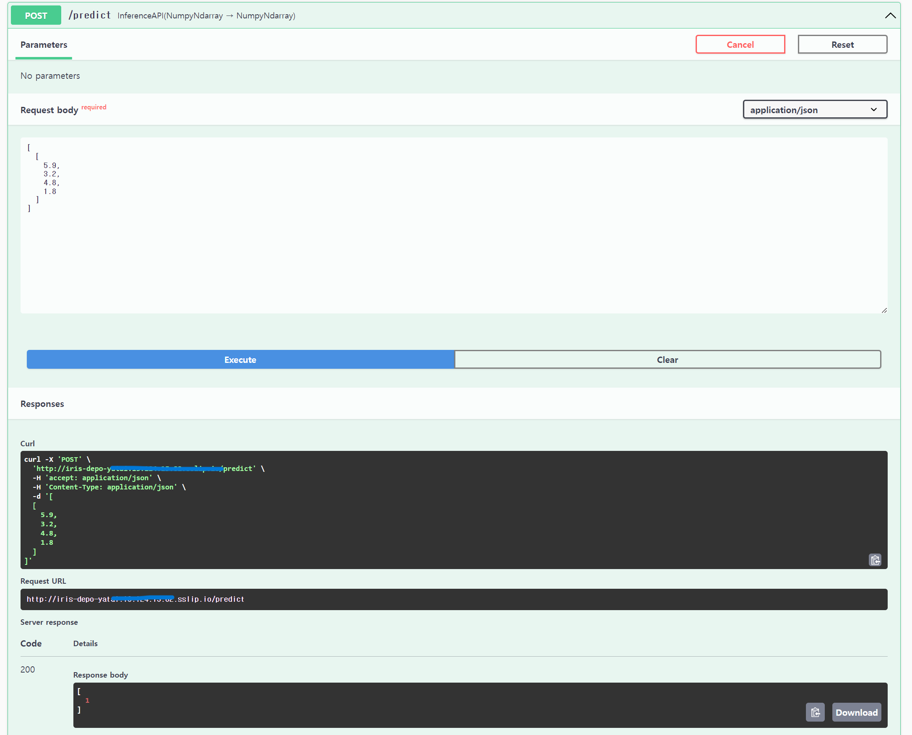

# Yatai 아키텍처 및 배포 방식

* toc
{:toc .large-only}

## Yatai 쿠버네티스 환경

Yatai는 대시보드를 제공하여 쿠버네티스 환경에서 BentoML 학습 모델들을 손쉽게 배포할 수가 있다. 따라서 Yatai를 사용하기 위해서는 우선적으로 쿠버네티스 클러스터가 구축되어 있어야 한다.


위 그림에서는 쿠버네티스 클러스터 아키텍처를 나타내 보았으며 다음과 같은 환경이 필요하다.

- 쿠버네티스 클러스터
  - 여기서는 아마존에서 제공하는 EKS 쿠버네티스 서비스를 이용했다.
- kubectl
  - 쿠버네티스 클러스터를 제어
- BentoML
  - Service 툴
  - 패키징 툴
  - 배포 툴
  - CLI

BentoML 리소스:  
- Model: 학습시킨 모델을 BentoML로 감싼 BentoML 학습 모델
- Bentos: 학습시킨 모델을 서비스화 시키기 위한 서비스 파일로 하나의 서버를 띄워 모델을 실행시킬 수 있음

BentoML을 설치하게 되면 위와 같은 컴포넌트들을 설치하게 된다. 또한 BentoML에서 모델과 서비스를 저장하면 로컬 환경 기본 디렉토리에 `models` 폴더와 `bentos` 폴더에 각 모델 파일들과 bento 서비스 파일들이 저장이 된다.

## Yatai 아키텍처

Yatai의 기본 아키텍처는 아래 그림처럼 나타낼 수가 있다.


모든 서비스들은 쿠버네티스 환경에서 동작하며 쿠버네티스 리소스 형태로 관리되며 주요 컴포넌트들은 다음과 같다.

### Yatai 대시보드

- 대시보드 인터페이스로 사용자가 접근하여 사용
- Model, Bento 관리를 위한 레지스트리
- Bento Push/Pull을 위한 API 제공

### RDS(Rational Database Service)

- Yatai 컴포넌트에 필요한 메타데이터 저장
- Model, Bento, User, 인증 정보 등 저장
- 위 예시에서는 AWS RDS에서 PostgreSQL을 설치하여 사용

### Object Storage Service

- Model, Bento 오브젝트 저장을 위한 버킷 스토리지
- 위 예시에서는 AWS S3 사용

### Yatai-image-builder

- 이미지 빌드를 위한 Add-On
- 위 예시에서는 AWS ECR 사용

### Docker Registry

- Bento로부터 빌드된 OCI 이미지를 저장
- 배포시에 해당 이미지를 Fetch

### Yatai-deployment

- 쿠버네티스 클러스터에 Bento 배포를 위한 Add-on

### Cert-manager

- 쿠버네티스 클러스터에 Certificate, CertificateIssuer 리소스 타입 추가
- BentoDployment CRD Conversion webhook에 필요

### metrics-server

- kubelet에서 리소스 metrics를 수집하여 쿠버네티스 api 서버 파드 오토스케일링

### Ingress Controller

- BentoDeployment에 대해 외부 접근 제어
- 로드밸런싱

## Yatai 리소스 관리 방식

Yatai에서 Model, Bento를 관리하는 방식을 그림으로 나타내 보았다.


### 모델 저장

학습 모델 서빙을 위해서는 우선 모델을 학습을 시켜야한다. 위에서 언급했듯이 BentoML 환경에서 모델을 서빙을 하려면 우선적으로 BentoML 형태로 저장이 된 학습 모델이어야하며 필요한 필수 파일들은 다음과 같다.

- `<model>.py`: BentoML 형태로 저장된 학습 모델 
- `<service>.py`: Bento 생성을 위한 서비스 정의 파일
- `bentoml.yaml`: 어떤 학습 모델을 사용해 서비스를 생성할껀지에 대한 설정 정보가 담긴 파일

**모델 저장 순서:**

1. 모델 저장  
    ```cmd
    python <model>.py
    ```
2. 위 명령어로 모델을 저장하면 로컬 환경에서 `models` 폴더에 각 리소스들이 자동 저장
    - `.yaml`: 모델의 설정 정보
    - `.pkl`: 모델 파일

### bentoml 빌드

**빌드 순서**

1. `bentoml.yaml` 파일이 있는 폴더에 가서 다음 명령어를 실행한다.
    ```
    bentoml build
    ```
2. 위 명령어로 빌드를 하며면 로컬 환경에서 `bentos` 폴더에 각 리소스들이 자동 저장
    - .yaml: 각종 bento 설정 정보가 담긴 yaml 파일
    - `<service>.py`: 위에서 사용한 서비스 정의 파일이 복사되어 저장
    - env: 각종 기타 환경 변수들이 저장

### bento push

빌드까지 마쳤으면 Yatai에 적용하기 위해 push를 해주어야 한다. 다음 과정을 통해 빌드로 자동 생성된 결과물을 업로드한다.

**Push 순서**

1. CLI 입력
    ```
    bentoml push <Service>:<Tag>
    ```
2. 대시보드 업데이트
   - model, bento가 대시보드 상에 자동 업데이트
3. Object Storage Service에 업로드
   - 위 모델 저장 과정에서 로컬 디렉토리에 저장했던 model, bento 서비스 관련 파일들을 자동 업로드 

## yatai 배포 방식

위에서 모델, 서비스들을 저장했다면 배포를 통해 학습 모델을 서빙하는 과정이다.

### 배포 과정

1. 대시보드에서 설정 후 배포
    
2. yatai-image0builder 자동 호출
3. `BentoRequest` CR 자동 생성
   - `BentoRequest` CR:어떤 요청을 할지에 대한 정보가 담김
4. Docker Registry에서 배포를 위한 도커 이미지가 있는지 확인
5. 없다면 빌드 후 이미지 자동 업로드
6. `Bento` CR 자동 생성
   - `Bento`: 배포하기 위한 Bento 정보가 담김
7. `BentoDeployment` CR 자동 생성
   - `BentoDeployment`: 배포 정보가 담김
8. 배포를 통해 컨테이너 자동 생성
9. 자동으로 Ingress 설정을 통해 엔드포인트를 오픈해주어 접근이 가능해짐

### 최종 배포된 결과


- 기본적으로 sslip.io를 사용하여 엔드포인트를 오픈해주는 것을 확인
- BentoML은 기본적으로 Swagger API 문서를 제공하여 Input/Output 타입 확인 가능



이처럼 Swagger를 통해 배포된 모델을 테스트하는 것도 가능하다.


<span style="font-size:70%">[참조]https://docs.yatai.io/en/latest/concepts/architecture.html</span>

끝!
